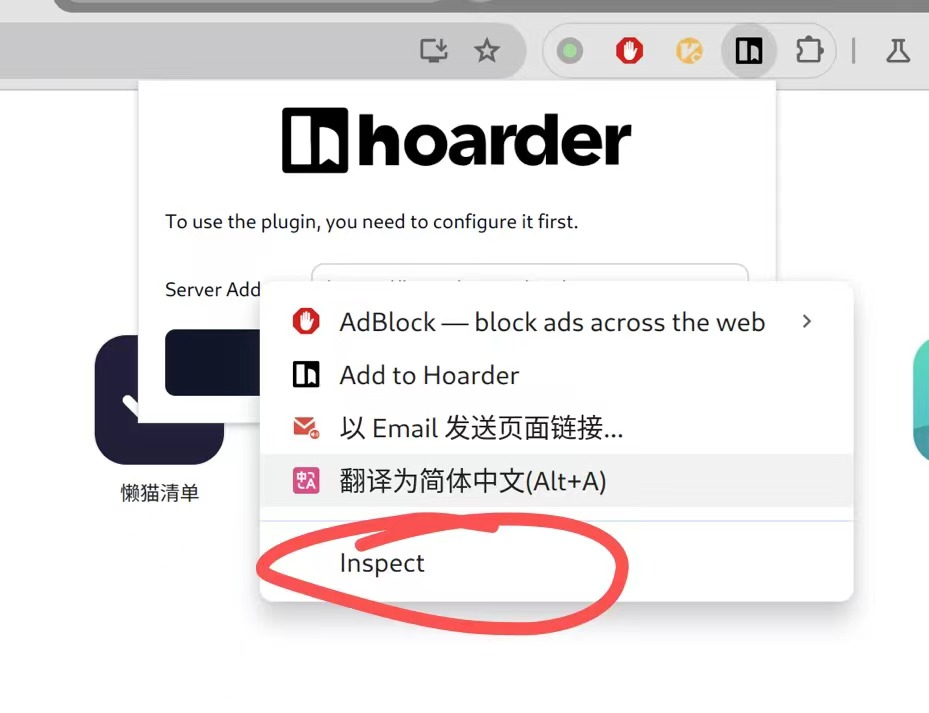
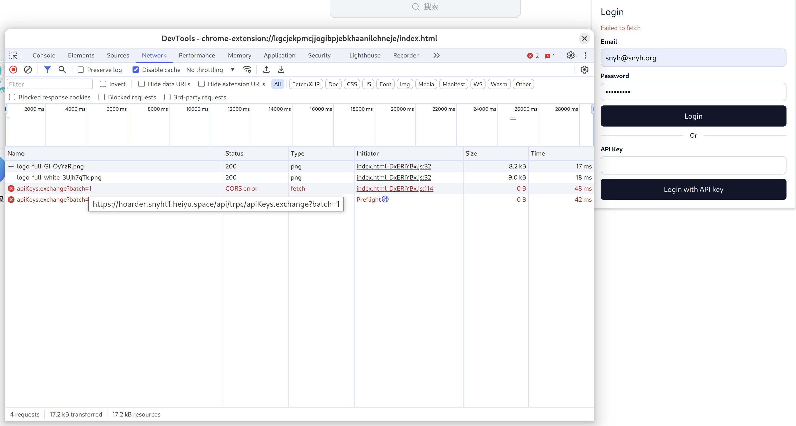

浏览器插件
========

如果您的应用支持浏览器插件访问，则需要配置`publich_path`，以便插件可以正常访问。

因为插件js的`context`与正常页面的`context`是隔离的，因此访问微服的登录cookie是不生效的。

需要将插件访问的url地址做[独立鉴权](./advanced-public-api)，让系统ingress放行相关请求，由应用自身进行鉴权。

调试方式一般是，先在插件页面右键点击`inspect`之类的按钮，访问到插件的调试工具栏。



在调试工具栏里跳转到`network`页面，然后尝试访问插件的功能，找到被401的地址。


比如`hoarder`这个插件访问的就是`/api/trpc/`路径。



我们将这个路径加到`lzc-manifest.yml`中

```yaml
application:
  subdomain: hoarder
  routes:
    - /=http://web.dev.libr.hoarder.lzcapp:3000/
  public_path:
   - /api/trpc/
```


:::warning 安全提示
加入到public_path的路径，请一定要多加测试，务必确保敏感数据有受到应用的额外保护。

配置后，可以在插件的调试页面里观察下实际访问的url地址，然后在命令行下用curl访问，看是否会被拒绝访问。
:::
