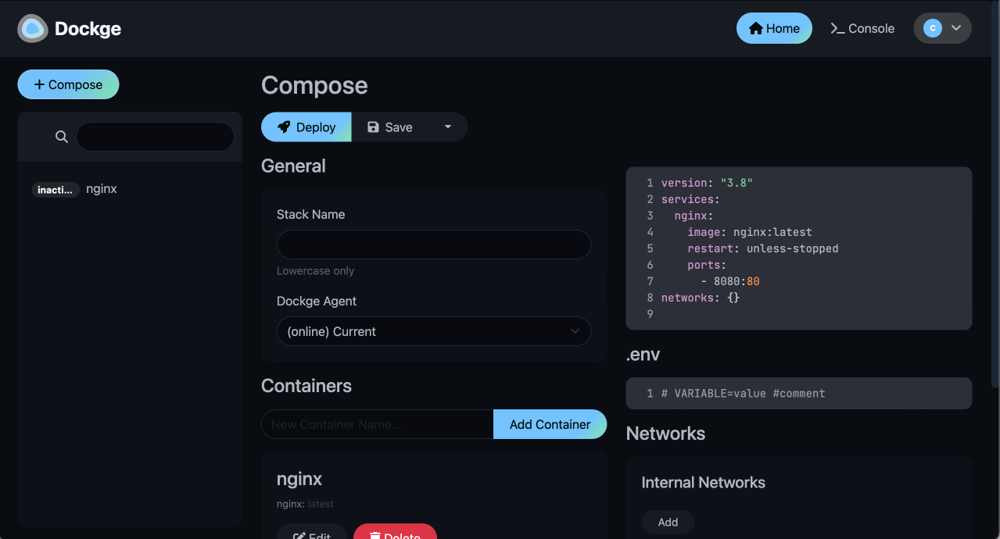

# dockerd 开发模式

部分开发者希望微服能提供完整的 docker 套件功能, 针对于这一类用户, 微服系统<Badge type="tip" text="≥v1.1.0" /> 提供了一个独立的 Docker 守护进程以供开发者使用。
并且现已支持非开发者使用<Badge type="tip" text="≥v1.3.0" />，只需要安装`Dockge`应用即可访问独立 docker 套件。

## 获取并安装Dockge应用
虽然非开发者用户可以使用独立 docker 套件，但具有`privileged`属性或赋予`CAP_SYS_ADMIN`等权限的容器可以读写并访问懒猫微服中的所有文件数据，甚至对系统造成无法修复的错误。因此请在启用独立 docker 套件后，仔细阅读本文的剩余内容。

<script setup>
const downloadFile = () => {
  const link = document.createElement('a');
  link.href = 'https://dl.lazycat.cloud/lzcos/files/ab6f5801-ea6a-47a6-bedd-9fd90f7de0de.lpk';
  link.download = 'dockge.lpk';
  link.click();
};
</script>

<button :class="$style.button" @click="downloadFile">下载Dockge应用LPK</button>

<style module>
.button {
  color: white;
  padding: 10px 20px;
  border-radius: 5px;
  font-weight: bold;
  background-color: #2965D7;
  cursor: pointer;
}
</style>

 - 点击上方按钮，下载`Dockge`应用lpk。
 - 将lpk上传至`懒猫网盘`，并右键安装。
 - 安装完成后重启懒猫微服，系统将自动激活独立 Docker 守护进程。

## 使用说明
### 关于docker存储位置
在独立 docker 套件中创建的容器将默认使用机械硬盘作为存储空间，容器在重启后内容将持久化存储。

### 将用户数据文件映射至容器内
docker容器默认状况下将与系统隔离，可以使用下面的compose表达式将用户磁盘数据绑定至容器内。
```yaml
service:
  example:
    volumes:
      - /data/document/{用户名}:/容器/内/路径
```

### 映射容器内端口
使用下面的compose表达式即可将容器内`2222`端口转发到外部的`3333`端口。如须访问，可通过懒猫微服`局域网ip:端口号`进行访问。
```yaml
service:
  example:
    ports:
      - 3333:2222
```

### 带有权限的容器
为容器添加`privileged`权限或某些[特权](https://man.archlinux.org/man/core/man-pages/capabilities.7.en)（例如`CAP_SYS_ADMIN`）会赋予该容器极高的系统权限。这样一来，容器可能会对懒猫微服的系统资源产生很大影响，甚至可能造成严重的安全风险。特别是在将容器的高风险端口暴露给外部网络时，容器可能成为攻击的目标。

如果容器内运行恶意程序，这些程序可能会影响系统的正常运行，甚至导致数据丢失或损坏。因此，在使用别人提供的Compose文件时，需要特别留意文件中是否会授予容器过多的权限，避免潜在的安全隐患。
```yaml
service:
  example:
    privileged: true
    cap_add: 
      - SYS_ADMIN 
      - NET_ADMIN # 开放所有网络相关权限
```

### 安装Dockge后无法创建容器
在安装Dockge后，如果您发现创建容器失败，且右下角有此提示弹出时。请确保第一次安装后已经重启微服。在不安装Dockge应用的情况下系统为保证安全将不会启用独立 docker 守护进程。


## 开发者用户通过`SSH`启用pg-docker

拥有`ssh`权限的开发者用户，也可以通过执行下面的命令开启此服务：
```bash
playgroundctl enable
```
调用后系统会下载相应的应用,并且开启服务
```bash
box-test ~ # playgroundctl enable
Installing LPK from URL: https://dl.lazycat.cloud/lzcos/files/cloud.lazycat.app.dockge.lpk
Installation succeeded.
Playground Docker 已启动, 已默认安装Dockge
Playground Docker 配置路径为/lzcsys/var/playground/daemon.json
如需设置docker默认存储位置, 请修改配置文件中的data-root
数据盘默认路径为/data, 如需使用系统固态硬盘, 可设置存储路径为/lzcsys/var/user_save, 固态硬盘空间有限, 请控制储存数据大小在200GiB内
在系统的其他路径中存储的文件, 可能会在重启后丢失!!
系统重启后, 需要开启Dockge应用或执行pg-docker <command>后, docker才会运行
-----本功能仅为临时方案, 后续可能无效!-----
```

:::tip 
请注意, 如需配置该docker的行为,请修改 **/lzcsys/var/playground/daemon.json**, 修改完成后需要执行`systemctl restart playground-docker` 重启服务
:::


开发者可以通过以下两种方式运行自己的容器

### Dockge 
该应用可以在应用列表中访问到, 通过 `dockge` 应用, 用户可以自己编写docker-compose 文件, 部署并且测试



### pg-docker
ssh 登录到微服之后, 用户可以直接使用 `pg-docker` 命令执行docker相关的命令, 通过pg-docker暴露的端口, 能够直接在内网中访问

