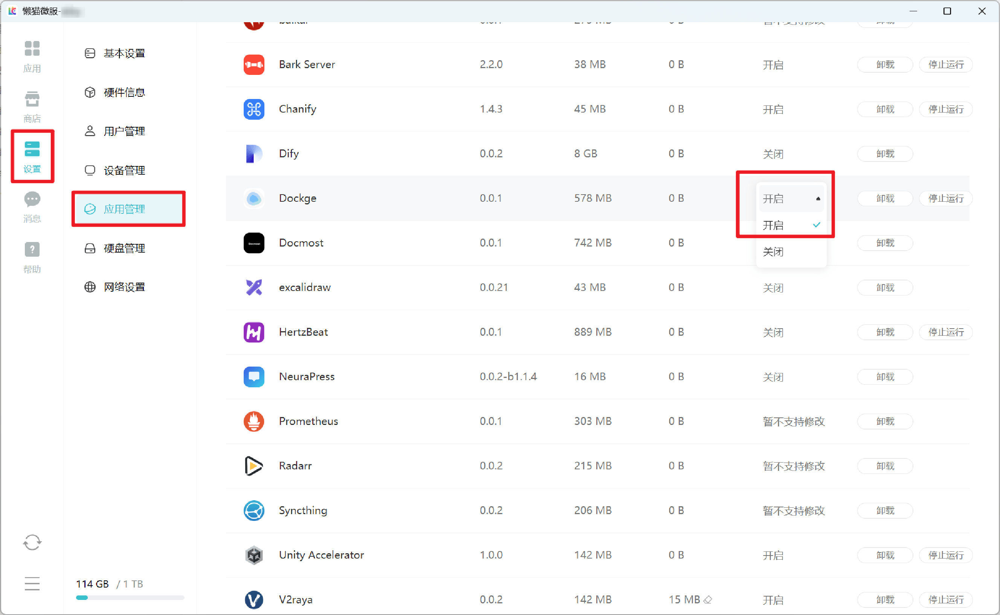

# How to Start Custom Scripts on Boot

::: warning
We strongly recommend that you do not modify system files in any way. If destructive operations occur, it may cause all rescue mechanisms of LCMD to fail.

If you must modify the system, it's recommended to add a 5-minute delay to have enough time to disable startup scripts
:::

Some developers who have applied for `SSH permissions` or senior users with technical capabilities will find that their boot startup scripts configured through `systemd` or other methods cannot run like normal Linux distributions after restarting LCMD MicroServer. This is because the LCMD system will [restore system modifications to initial state](faq-dev.md#为何-ssh-后安装的软件会丢失-readonly_lzcos) after restart. However, after introducing [playground-docker<Badge type="tip" text="LCMD system v1.1.0" />](dockerd-support.md), you can run some custom scripts on boot by using playground-docker features.


::: tip v1.3.7-alpha.1+ supports [systemd --user](https://nts.strzibny.name/systemd-user-services/) method to start user scripts

Create a service file with any name in the ~/.config/systemd/user/ directory, for example:

```
lzcbox-a85a42da ~/.config/systemd/user # cat setup-apt-mirror.service
[Unit]
Description=Switch apt source to Mainland China and automatically install htop
After=network.target

[Service]
Type=oneshot
ExecStart=sh -c 'apt install -y htop'

[Install]
WantedBy=default.target
```

Then use `systemctl --user enable setup-apt-mirror.service` to automatically run on boot
:::


## Configuration Method

1. Download the Dockge application from the LCMD store

2. In LCMD Settings -> Application Management -> Find the Dockge application and set "Application Auto-start" to "Enable"



3. Open Dockge in the application and create a new compose configuration, set the container name. The compose configuration can refer to the example given below. After configuration is complete, click deploy.

```yaml
services:
  Debian:
  #Service name can be modified by yourself
    image: registry.lazycat.cloud/debian:autostart_mod
    #This image can be pulled directly in LCMD MicroServer without configuring proxy
    privileged: true
    #Note: if the script doesn't need to modify the system, don't add this
    restart: always
    entrypoint: /bin/init
    #Here you need to use init to prevent container restart after script ends
    command: sh /data/document/<username>/<cloud storage path>/script.sh
    #Set the command at startup, note the path of the script in this container
    volumes:
      - /data/document/<username>:/data/document/<username>:ro
      #This configuration mounts the cloud storage directory to the /data/document/<username> directory in the container. The ":ro" at the end is used to prevent modification of the cloud storage directory. This field can be modified as needed
      - /data/playground/docker.sock:/var/run/docker.sock
      #This configuration can bind the playground-docker socket file to the container, allowing the container to modify playground-docker.
    network_mode: "host"
    #Adding this field and combining with privileged can control LCMD system network devices
```


