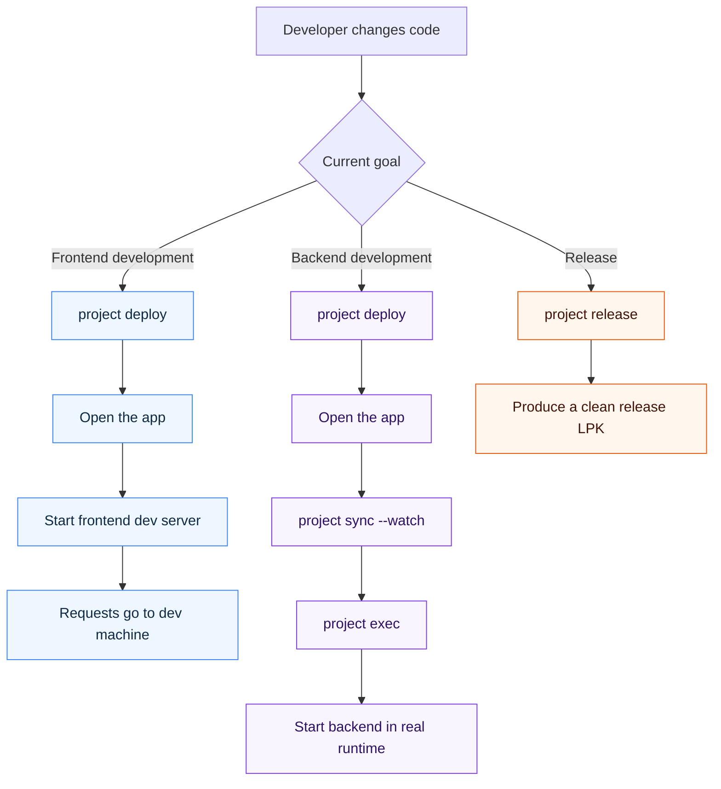
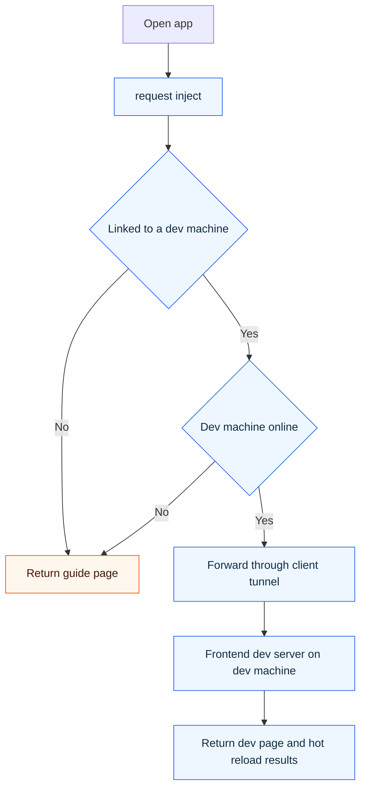
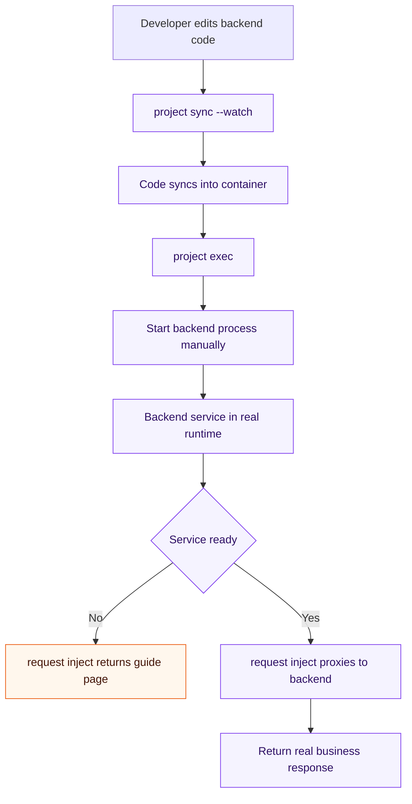

# Dev Workflow Overview {#dev-workflow}

This page answers one practical question: what order should you follow when developing apps for Lazycat microservice?

If you only remember one thing, remember this:

1. Frontend development: run `project deploy`, open the app, then start the local dev server.
2. Backend development: run `project deploy`, open the app, then sync code into the real runtime and start the process manually.
3. Release: always build the release package from `lzc-build.yml` and final artifacts.

## Goal {#goal}

After this page, you should be clear about:

1. Which files belong to development and which belong to release.
2. Why frontend traffic is redirected to the dev machine.
3. Why backend code is expected to run inside the real microservice runtime.
4. When to use `project deploy`, `project sync --watch`, and `project release`.

## Workflow Map At A Glance {#workflow-map}



The core decision is simple:

1. If you are changing frontend code, redirect traffic to the dev machine.
2. If you are changing backend code, move the code into the real microservice runtime.
3. If you are publishing, keep only release artifacts.

## Prerequisites {#prerequisites}

Before starting, assume you have already done the following:

1. Finished [Environment Setup](./env-setup.md).
2. Successfully completed [Hello World in 5 Minutes](./hello-world-fast.md) at least once.
3. Verified that local `lzc-cli` can reach the target microservice.
4. Know the basic files in your project root.

## Build One Mental Model First {#mental-model}

The recommended workflow is easiest to understand with these three layers:

1. `lzc-build.yml`
   Purpose: the release build config.
2. `lzc-build.dev.yml`
   Purpose: the development override config that only stores dev-specific differences.
3. `lzc-manifest.yml`
   Purpose: the stable app runtime structure; dev-only logic is enabled or removed by `#@build` preprocessing.

A typical project usually keeps these four files:

1. `lzc-manifest.yml`
2. `package.yml`
3. `lzc-build.yml`
4. `lzc-build.dev.yml`

A minimal dev config often looks like this:

```yml
pkg_id_suffix: dev

envs:
  - DEV_MODE=1
```

The important parts are:

1. `pkg_id_suffix: dev`
   Purpose: prevent dev deployment from overwriting the release app.
2. `DEV_MODE=1`
   Purpose: make dev-only `#@build` blocks in `lzc-manifest.yml` active only in development.

## Which Build Config Do `project` Commands Use {#project-defaults}

If `lzc-build.dev.yml` exists, these commands prefer it by default:

1. `lzc-cli project deploy`
2. `lzc-cli project info`
3. `lzc-cli project start`
4. `lzc-cli project exec`
5. `lzc-cli project cp`
6. `lzc-cli project sync`
7. `lzc-cli project log`

Every command prints the active `Build config` line, which tells you which build config file is actually in use.

If you want the release config explicitly, add `--release`:

```bash
lzc-cli project deploy --release
lzc-cli project info --release
```

`project release` always uses `lzc-build.yml`.

## Why Dev Logic Belongs to Request Inject {#why-request-inject}

The core of this workflow is [`request inject`](../advanced-inject-request-dev-cookbook.md).

The reason is straightforward:

1. For frontend development, browser traffic must be redirected to the dev server running on the dev machine.
2. For backend development, requests may need to return a guide page, proxy to a service in the container, or proxy to the dev machine depending on runtime state.
3. All of these behaviors belong to request handling, so request inject is the natural place for them.

The recommended pattern is:

1. Keep release routes stable.
2. Put dev-only inject logic inside `#@build if env.DEV_MODE=1`.
3. This ensures the release package does not physically contain development-only request splitting logic.

Minimal example:

```yml
application:
  routes:
    - /=file:///lzcapp/pkg/content/dist
#@build if env.DEV_MODE=1
  injects:
    - id: dev-entry
      on: request
      when:
        - "/*"
      do:
        - src: |
            // dev-only request inject
#@build end
```

## Frontend Development Path {#frontend-dev}
### Frontend Flow Diagram {#frontend-dev-diagram}




### When To Use It

Use this path when your frontend runs on the dev machine, for example with:

```bash
npm run dev
```

The app entry traffic is redirected to that dev machine by request inject.

### Recommended Order

1. `lzc-cli project deploy`
2. `lzc-cli project info`
3. Open the app first
4. Then run `npm run dev`
5. Refresh the page and continue development

### Why Open the App Before Starting the Dev Server

This gives you three immediate benefits:

1. You can confirm whether the instance is already linked to the dev machine.
2. The page tells you which port the inject script is actually waiting for.
3. If the dev machine is offline, or the instance has not synced its dev-machine link yet, the page gives explicit guidance instead of showing only a blank page or a generic proxy error.

### Typical Request Flow

1. The browser opens the app domain on the microservice.
2. Request inject first checks whether this instance is already linked to a dev machine.
3. If it is linked, the request is forwarded to that machine through the client tunnel.
4. The frontend dev server returns the page and hot-reload results.

### How To Verify Success

Any of the following means the frontend flow is working:

1. The page stops showing the “waiting for development environment” guide and shows your real dev page.
2. Changes in files like `src/App.vue` appear after refresh.
3. `project log -f` no longer reports that the dev machine is offline or unavailable.

### Terminology Note

In implementation terms, this dev-machine link maps to `ctx.dev.id` in the inject context.
At the getting-started level, you only need to understand it as: the app instance knows which dev machine should receive development traffic.

## Backend Development Path {#backend-dev}
### Backend Flow Diagram {#backend-dev-diagram}




### When To Use It

Use this path when backend code must run inside the real microservice runtime, for example when it depends on:

1. Real `/lzcapp/run` or `/lzcapp/var` paths.
2. Runtime sockets, mounts, permissions, or real container networking.
3. A runtime environment that is hard to simulate fully on the dev machine.

### Recommended Order

1. `lzc-cli project deploy`
2. `lzc-cli project info`
3. Open the app first
4. If the page says the backend is not ready, then start sync and the backend process
5. Refresh again after the backend is ready

A common loop looks like this:

```bash
lzc-cli project sync --watch
lzc-cli project exec /bin/sh
# inside container
/app/run.sh
```

### Why Backend Development Is Not Centered On Local Simulation

Because at this stage you are validating how the code behaves inside the real microservice runtime, not only whether the code is syntactically correct or logically valid.

That means the real questions are:

1. Can the backend start correctly in the real container?
2. Does it behave correctly with real `/lzcapp/*` paths?
3. Can request inject switch traffic based on real backend readiness?

### Current Template Guidance

The current template direction is roughly:

1. `golang`
   - Dev mode does not auto-start the backend.
   - You build and start it manually for full control.
2. `springboot`
   - Dev mode does not auto-start the backend.
3. `python` / `node`
   - These are better suited for a dev service that runs directly, with request inject forwarding traffic to it.

### How To Verify Success

Any combination of the following usually means the backend path is working:

1. `project sync --watch` keeps syncing without errors.
2. `project exec /bin/sh` enters the container and lets you start the backend manually.
3. The app page switches from a backend guide page to the real business response.
4. Requests are correctly forwarded by request inject after refresh.

## Release Path {#release-workflow}

The goal of release is simple: produce a clean, stable LPK without development-side effects.

### What A Release Package Should Look Like

1. It uses `lzc-build.yml`.
2. It does not carry `pkg_id_suffix`.
3. It does not include dev-only `#@build` branches.
4. The image contains only final artifacts, not dev toolchains.
5. If release does not need static content, `contentdir` can be omitted.

### Release Command

```bash
lzc-cli project release -o app.lpk
```

### How To Verify The Release Package Is Clean

At minimum, check these points:

1. The package name does not contain `.dev` or a similar suffix.
2. The packaged manifest does not contain dev-only inject blocks.
3. The release image is not built from `Dockerfile.dev` or another dev alias.
4. The release package works without the dev machine being online.

## A Simple Decision Table {#decision-table}

When you are unsure which path to use, decide from this table:

| Your Goal | Use This | Do Not Start With |
| --- | --- | --- |
| Change UI and iterate with hot reload | `project deploy` + open app + `npm run dev` | Do not start from release packaging |
| Change backend code that depends on real `/lzcapp/*` runtime | `project deploy` + `project sync --watch` + `project exec` | Do not prioritize full local runtime simulation |
| Build a package for others to install | `project release` | Do not treat a dev deployment result as the release package |

## Common Errors {#common-errors}

### 1. Dev changes overwrite the release app

This usually means:

1. The project does not have `lzc-build.dev.yml`.
2. Or it exists but does not contain `pkg_id_suffix: dev`.

Fix:

1. Check whether `lzc-build.dev.yml` exists.
2. Check the printed `Build config` line in command output.
3. Check whether `pkg_id_suffix: dev` is present.

### 2. The page keeps showing a waiting-for-development guide

This usually means:

1. The frontend dev server is not started.
2. The instance has not synced its dev-machine link yet.
3. The dev machine is offline.

Fix:

1. Run `lzc-cli project deploy` again.
2. Start `npm run dev`.
3. Refresh and compare the actual listening port with the port shown on the guide page.

### 3. Backend code is synced, but the app still does not work

This usually means:

1. The backend process did not really start.
2. The request inject target does not match the actual listening address.
3. The service has started but is not ready yet.

Fix:

1. Use `lzc-cli project exec /bin/sh` to verify inside the container.
2. Use `lzc-cli project log -f` for runtime logs.
3. Compare the actual backend address with the request inject target and ready condition.

## Next Step {#next-step}

Continue in this order:

1. If you have not run the workflow once yet, go back to [Hello World in 5 Minutes](./hello-world-fast.md).
2. If you want to write request inject rules, continue with [Request Inject Dev Cookbook](../advanced-inject-request-dev-cookbook.md).
3. If you want to connect a backend over HTTP, continue with [HTTP Routing with Backend](./http-route-backend.md).
4. If you want the exact build field definitions, continue with [lzc-build.yml Specification](../spec/build.md).
