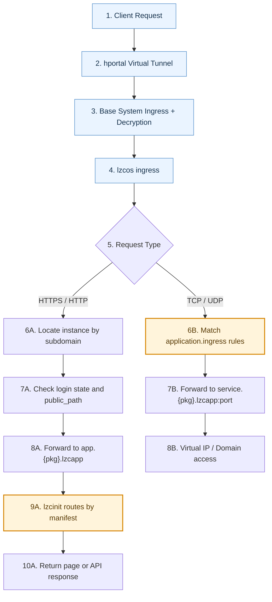

# How LPK Works: Core Mechanism and Minimal Spec {#lpk-how-it-works}

## Why LPK {#why-lpk}

First, consider traditional Docker/Compose delivery:

1. Docker Compose solves part of multi-container orchestration and is better than ad-hoc commands.
2. But during final delivery, operational burden often still falls to end users (env vars, upgrades/rollback, data path, logs).
3. This causes role overlap: IT maintenance work that should belong to developers/platform shifts to end users.
4. For non-technical users, this is usually complex and risky.

In Lazycat microservice, LPK completes this chain by moving responsibilities to "developer + platform":

1. Developers package app identity, version, entry routes, exposure boundaries, deployment form, and data semantics into LPK.
2. Platform provides standardized install/start/runtime/isolation mechanisms.
3. End users receive a one-click reproducible package and focus on usage instead of operations.

## Goal {#goal}

After this guide, you can verify these 5 points:

1. LPK is a package file (`tar` or `zip`); you can inspect its internals by changing extension.
2. `lzc-build.yml` is build-stage only. After package is produced and installed, runtime flow does not read your local `lzc-build.yml`.
3. You can build a valid LPK even without `lzc-cli`.
4. Compose solves part of orchestration, while LPK further solves microservice delivery and operation-role separation.
5. Understand the two traffic paths for an app in Lazycat: the default HTTPS/HTTP path and the TCP/UDP L4 forwarding path. The runtime term for this app instance is `lzcapp`.

## Prerequisites {#prerequisites}

1. You completed [HTTP Routing with Backend](./http-route-backend.md).
2. You have run `lzc-cli project deploy` at least once.

## App Traffic Map (runtime term: `lzcapp`) {#lzcapp-traffic-map}



Legend:

1. Blue nodes (`1~4`): platform-level security mechanism, app-agnostic.
2. Orange nodes (`6B`, `9A`): the main places app developers need to care about, technically `application.ingress` and `manifest.yml`.

### Code-level mapping (summary) {#code-level-mapping}

1. ingress extracts subdomain from `Host` and resolves target app instance (supports multi-instance mapping).
2. HTTPS/HTTP path checks login state; unauthenticated and non-`public_path` requests are redirected to login.
3. After checks, the request is forwarded to the target app; then `lzcinit` routes it by `manifest.yml` (`routes/upstreams`).
4. TCP/UDP path uses `application.ingress` for L4 matching/forwarding and does not parse HTTP semantics.
5. For L4 ingress, system allocates/maintains dedicated virtual IP mapping; domain access resolves to that virtual IP.

Differences:

1. Both paths are identical before ingress.
2. HTTPS/HTTP does instance routing + access control + manifest-based routing.
3. TCP/UDP does pure L4 forwarding.

Further reading:

1. [TCP/UDP Layer 4 Forwarding](../advanced-l4forward.md)

## 1. Development and Release Flow (by scenario) {#dev-and-release-flow}

### Scenario A: Daily development {#scenario-a-daily-development}

Goal: rapid verification on target microservice.

```bash
lzc-cli project deploy
lzc-cli project info
```

Default behavior:

1. New projects normally contain `lzc-manifest.yml`, `package.yml`, and `lzc-build.yml`.
2. `project` commands prefer `lzc-build.dev.yml` when it exists.
3. Each command prints the active `Build config` line.
4. `package.yml` is where static package metadata now lives, instead of the top level of `lzc-manifest.yml`.
5. Use `--release` if you want to operate on the release build config `lzc-build.yml`.
6. `lzc-build.dev.yml` should keep dev-only diffs, for example `package_override.package: org.example.todo.dev` and an empty `contentdir:` when you want to suppress release static content in dev.

### Scenario B: CI release {#scenario-b-ci-release}

Goal: produce distributable artifact only.

```bash
lzc-cli project release -o release.lpk
lzc-cli lpk info release.lpk
```

### LPK distribution {#lpk-distribution}

`release.lpk` is commonly used by:

1. App Store distribution.
2. Direct file sharing; receiver can place `.lpk` into Lazycat drive and click install.

## 2. LPK as an archive package {#lpk-as-archive}

Generate package:

```bash
lzc-cli project release -o release.lpk
lzc-cli lpk info release.lpk
```

Typical contents:

1. `manifest.yml`: the app runtime description.
2. `content.tar` or `content.tar.gz`: static app content.
3. `images/`: optional embedded OCI image layout.
4. `images.lock`: optional layer source metadata (`embed` / `upstream`).

Notes:

1. You can inspect `.lpk` with archive tools.
2. Most tools do not recognize `.lpk` directly; copy and rename to `.tar` or `.zip` based on detected `format`.

## 3. `lzc-build.yml` is build-stage only {#build-yml-build-stage-only}

`lzc-build.yml` defines how package is produced, for example:

1. Which `buildscript` to run.
2. Which `contentdir` to collect.
3. How `images` are built (embedded image workflow).
4. Whether `package_override.package` produces an isolated dev package ID.

Install/runtime flow consumes artifacts inside LPK (`manifest.yml`, `content.tar`, `images.lock`, etc.), not your local `lzc-build.yml` file.

## 4. Build LPK without `lzc-cli` {#build-lpk-without-cli}

`lzc-cli` is recommended for engineering efficiency, but LPK format is open and can be generated manually.

Minimal tar-form example:

```bash
mkdir -p manual-lpk/web

cat > manual-lpk/package.yml <<'YAML'
package: org.example.hello.manual
version: 0.0.1
name: hello-manual
YAML

cat > manual-lpk/manifest.yml <<'YAML'
application:
  subdomain: hello-manual
  routes:
    - /=file:///lzcapp/pkg/content/web
YAML

cat > manual-lpk/web/index.html <<'HTML'
<html><body><h1>Hello Manual LPK</h1></body></html>
HTML

tar -C manual-lpk -cf manual-lpk/content.tar web
tar -C manual-lpk -cf hello-manual.lpk manifest.yml package.yml content.tar
```

Install this manually built LPK:

```bash
lzc-cli lpk install hello-manual.lpk
```

## 5. Where to check first when things fail {#where-to-check-first}

1. Build failed: check `lzc-build.yml` and build logs.
2. Installed but inaccessible: check `application.routes` in `lzc-manifest.yml`, which defines where requests should go.
3. Version not updated: check `Current version deployed` in `lzc-cli project info`.
4. Service errors: check `lzc-cli project log -f`.

## Verification {#verification}

```bash
lzc-cli project release -o release.lpk
lzc-cli lpk info release.lpk
lzc-cli project info
```

You should be able to answer:

1. Is `release.lpk` tar or zip, and how to inspect internals.
2. Why `lzc-build.yml` is build-stage only.
3. Minimal files required to manually produce valid LPK.
4. How LPK shifts operational burden from end users to developers/platform.

## Troubleshooting {#troubleshooting}

### 1. `Build config file not found` {#error-build-config-not-found}

Fix: ensure you are in project root and `lzc-build.yml` or `lzc-build.dev.yml` exists. The printed `Build config` line tells you which file the command is actually using.

### 2. Manifest changed but behavior unchanged {#error-manifest-changed-no-effect}

Fix: rerun `project deploy` (not only `project info`).

### 3. `embed:<alias>` alias not found {#error-embed-alias-not-found}

Fix: ensure matching alias exists under `lzc-build.yml.images`.

### 4. Cannot open `release.lpk` directly {#error-cannot-open-lpk-directly}

Fix:

1. Run `lzc-cli lpk info release.lpk` and check `format`.
2. Copy and rename extension to `release.tar` or `release.zip`, then open.

## Next {#next}

Continue with: [Advanced Embedded Image Practice](./advanced-vnc-embed-image.md)

Further reading:

1. [lzc-build.yml Spec](../spec/build.md)
2. [lzc-manifest.yml Spec](../spec/manifest.md)
3. [lpk format Spec](../spec/lpk-format.md)
