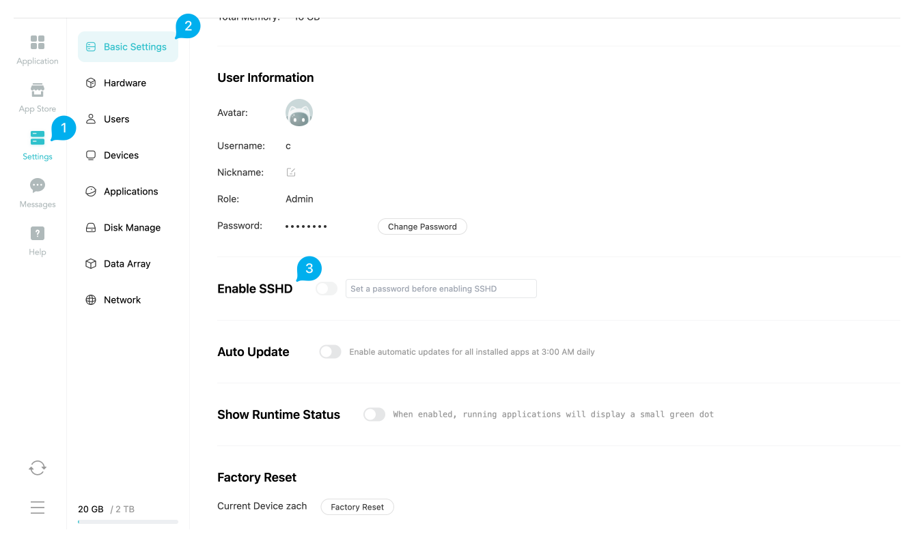

# Enable SSH

## How to Enable SSH?

1. Administrator account logs into Lazycat client, go to 'Settings' -> 'Basic Information'

2. Scroll down to find **Enable SSHD** 

   Set root user password and enable the option
   

3. Execute `ssh root@{LCMD_name}.heiyu.space` in your preferred terminal

4. cat /data/README.md to view data disk related file descriptions

::: tip Using Public Key to Login SSH

After lzcos v1.3.2+ version, the root user's home directory will be adjusted to permanent storage.

If you need to use public key login, you can use ssh-copy-id root@xxx.heiyu.space on your computer to automatically add the local public key to LCMD.

If there's no ssh-copy-id command on your computer, you can manually add the public key to the ~/.ssh/authorized_keys file after SSH login
:::

Due to technical reasons, it's impossible to provide a normal LCMD platform while the underlying system can be arbitrarily modified, so it's not suitable for directly installing system software to provide services.
The main purposes of SSH are:

1. Observe and audit system behavior
2. High-risk network operations such as [nmtui](./network-config.md)
3. Use unrestricted dockerd services with [playground-docker](./dockerd-support.md)
