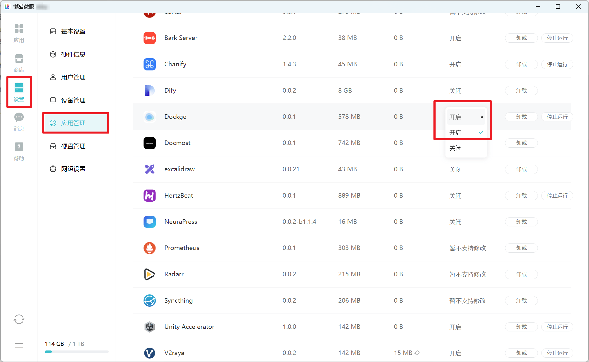
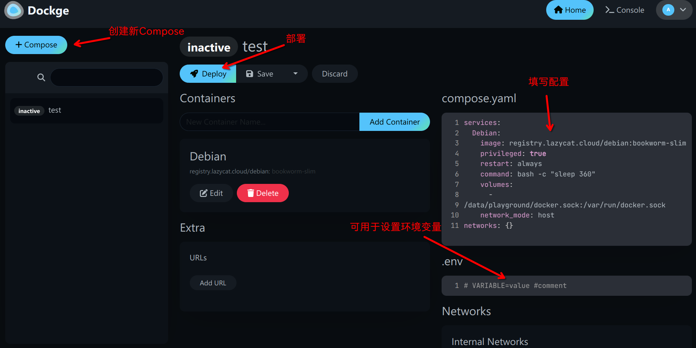

# 如何在开机时启动自定义的脚本

::: warning
强烈不建议您通过任何方式对系统文件进行修改，如果出现破坏性操作，可能导致微服所有的救援机制都失效。

如果一定要对系统进行修改，建议增加5分钟的延迟，以便有足够的时间禁用启动脚本
:::

部分申请了`SSH权限`的开发者或有技术能力的资深用户在重启懒猫微服后，会发现自己通过`systemd`或其他方法配置的开机启动脚本无法像
正常Linux发行版一样运行，这是因为懒猫系统重启后将[还原系统修改到初始状态](faq-dev.md#为何-ssh-后安装的软件会丢失-readonly_lzcos)。不过在引入[playground-docker<Badge type="tip" text="微服系统v1.1.0" />](dockerd-support.md)后，
可以通过使用playground-docker的特性在开机时运行一些自定义脚本。


::: tip v1.3.7-alpha.1+后支持[systemd --user](https://nts.strzibny.name/systemd-user-services/)方式启动用户脚本

在~/.config/systemd/user/目录下创建任意名称的service文件，比如

```
lzcbox-a85a42da ~/.config/systemd/user # cat setup-apt-mirror.service
[Unit]
Description=切换apt源为 中国大陆，并自动安装上htop
After=network.target

[Service]
Type=oneshot
ExecStart=sh -c 'apt install -y htop'

[Install]
WantedBy=default.target
```

然后使用`systemctl --user enable setup-apt-mirror.service` 即可自动开机运行
:::


## 配置方法

1. 在微服商店下载Dockge应用

2. 在微服设置——>应用管理——>找到Dockge这个应用并将“应用自启动”设置为“开启”



3. 在应用里面打开Dockge新建一个compose配置，并设置容器名称，compose配置可以参考下面给出的示例，配置完成后点击部署。

```yaml
services:
  Debian:
  #服务名称可自行修改
    image: registry.lazycat.cloud/debian:autostart_mod
    #此镜像可直接在懒猫微服中进行拉取，无需配置代理
    privileged: true
    #注意，如脚本无需对系统进行修改则不要添加
    restart: always
    entrypoint: /bin/init
    #这里需要使用init来防止脚本结束后容器重启
    command: sh /data/document/<用户名>/<网盘内路径>/script.sh
    #设置启动时的指令，需要注意脚本在此容器中的路径
    volumes:
      - /data/document/<用户名>:/data/document/<用户名>:ro
      #此配置将网盘目录挂载到容器的/data/document/<用户名>目录下。后面的":ro"用于防止对网盘目录进行修改。该字段可视情况进行修改
      - /data/playground/docker.sock:/var/run/docker.sock
      #此配置可以将playground-docker的socket文件绑定到容器内，允许容器对playground-docker进行修改。
    network_mode: "host"
    #添加该字段并配合privileded可以控制微服系统的网络设备
```


