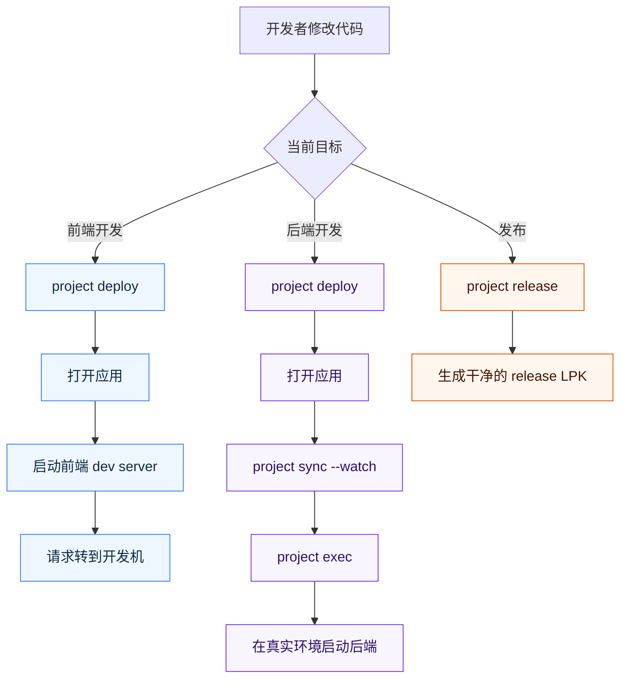
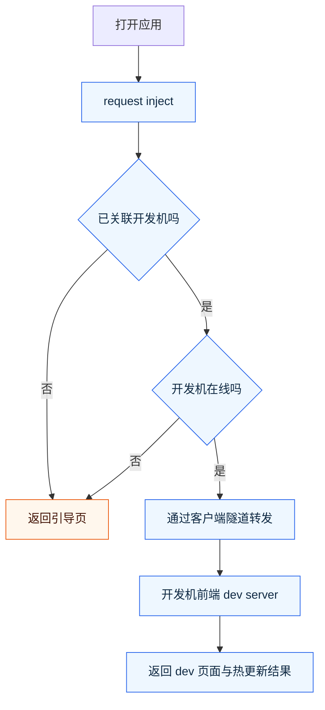
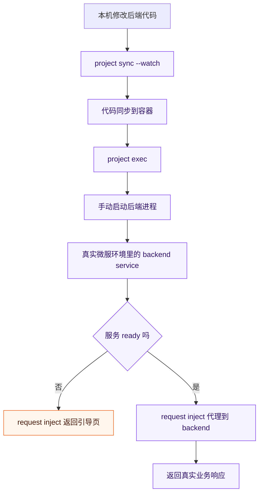

# 开发流程总览 {#dev-workflow}

这一页只解决一个问题：你在懒猫微服里开发应用时，应该按什么顺序工作。

如果你只记住一句话，可以记这个：

1. 前端开发：先 `project deploy`，再打开应用，再启动本机 dev server。
2. 后端开发：先 `project deploy`，再打开应用，再把代码同步进真实运行环境并手动启动进程。
3. 发布：始终用 `lzc-build.yml` 和最终产物构建发布包。

## 目标 {#goal}

看完这一页后，你应该能明确：

1. 开发态和发布态分别用哪套文件。
2. 前端开发时流量为什么会转到开发机。
3. 后端开发时为什么推荐在真实微服环境里运行代码。
4. 什么时候用 `project deploy`，什么时候用 `project sync --watch`，什么时候用 `project release`。

## 一图看懂三条主线 {#workflow-map}



图里最重要的判断只有一个：

1. 改前端，就把请求转到开发机。
2. 改后端，就把代码放进真实微服运行环境。
3. 做发布，就只保留 release 所需产物。

## 前置条件 {#prerequisites}

开始前，默认你已经满足下面条件：

1. 已完成 [开发者环境搭建](./env-setup.md)。
2. 已至少成功跑通过一次 [Hello World](./hello-world-fast.md)。
3. 本机 `lzc-cli` 能连接到目标微服。
4. 你知道当前项目根目录里有哪些核心文件。

## 先建立一个统一心智模型 {#mental-model}

建议先按下面三层理解整个开发流程：

1. `lzc-build.yml`
   作用：发布包构建配置。
2. `lzc-build.dev.yml`
   作用：dev 构建覆盖配置，只保存开发态差异。
3. `lzc-manifest.yml`
   作用：应用运行结构本身；其中 dev 专属逻辑通过 `#@build` 预处理块决定是否进入最终包。这里可以先把它理解成“应用运行说明文件”。

典型项目通常只维护这四类文件：

1. `lzc-manifest.yml`
2. `package.yml`
3. `lzc-build.yml`
4. `lzc-build.dev.yml`

推荐的 dev 配置通常长这样：

```yml
pkg_id: org.example.todo.dev
contentdir:

envs:
  - DEV_MODE=1
```

这里最重要的是三点：

1. `pkg_id: org.example.todo.dev`
   作用：保证开发部署不会覆盖正式安装包。
2. `contentdir:`
   作用：若 release 配置了静态目录，dev 可用空值覆盖它，避免误打包本地未构建产物。
3. `DEV_MODE=1`
   作用：让 `lzc-manifest.yml` 里的 dev-only `#@build` 片段只在开发态生效。

## `project` 命令默认会选哪套配置 {#project-defaults}

只要项目中存在 `lzc-build.dev.yml`，下面这些命令默认优先使用它：

1. `lzc-cli project deploy`
2. `lzc-cli project info`
3. `lzc-cli project start`
4. `lzc-cli project exec`
5. `lzc-cli project cp`
6. `lzc-cli project sync`
7. `lzc-cli project log`

每个命令都会打印一行 `Build config`，就是在告诉你“这次实际用了哪个构建配置文件”。

如果你要显式操作发布配置，直接加 `--release`：

```bash
lzc-cli project deploy --release
lzc-cli project info --release
```

而 `project release` 永远使用 `lzc-build.yml`。

## 为什么 dev 逻辑要放到 request inject 里 {#why-request-inject}

开发流程的核心是请求分流脚本（[`request inject`](../advanced-inject-request-dev-cookbook.md)）。

原因很简单：

1. 前端开发时，你要把浏览器访问流量转到开发机上跑的 `npm run dev`。
2. 后端开发时，你要根据真实服务是否就绪，动态返回引导页、代理到容器内服务，或者代理到开发机。
3. 这些行为都属于“请求进入应用后如何处理”，最自然的位置就是 request inject。

推荐模式是：

1. 发布包里的路由保持稳定。
2. dev 专属 inject 只放在 `#@build if env.DEV_MODE=1` 里。
3. 这样最终发布包里物理上不会带任何开发态分流逻辑。

最小示例：

```yml
application:
  routes:
    - /=file:///lzcapp/pkg/content/dist
#@build if env.DEV_MODE=1
  injects:
    - id: dev-entry
      on: request
      when:
        - "/*"
      do:
        - src: |
            // dev-only request inject
#@build end
```

## 前端开发主线 {#frontend-dev}
### 前端开发示意图 {#frontend-dev-diagram}




### 适用场景

你的前端代码在开发机上跑，例如：

```bash
npm run dev
```

应用访问流量通过 request inject 被转到开发机。

### 推荐顺序

1. `lzc-cli project deploy`
2. `lzc-cli project info`
3. 先打开应用
4. 再执行 `npm run dev`
5. 刷新应用页面继续开发

### 为什么要先打开应用，再启动 dev server

这样做有三个直接好处：

1. 你能立即看到当前实例是否已经关联到开发机。
2. 页面可以明确告诉你请求分流脚本正在等待哪个端口。
3. 如果开发机未在线，或实例还没同步“开发机关联标识”，页面会直接给出下一步引导，而不是只看到 502 或空白页。

### 典型请求流

1. 浏览器访问微服里的应用域名。
2. request inject 先检查当前实例是否已经关联到某台开发机。
3. 如果已关联，再通过客户端隧道把请求转到那台开发机。
4. 开发机上的 `npm run dev` 返回页面与热更新结果。

### 你应该如何验证成功

满足下面任一条，就说明前端开发流已跑通：

1. 页面不再显示“等待开发环境”引导，而是显示你的 dev 页面。
2. 修改 `src/App.vue` 后，浏览器刷新立即生效。
3. `project log -f` 中不再看到“开发机未就绪”这类提示。

### 术语说明

这一页里提到的“开发机关联标识”，技术上对应 inject 上下文里的 `ctx.dev.id`。
你在入门阶段只需要把它理解成：当前应用实例知道应该把开发流量转发到哪一台开发机。

## 后端开发主线 {#backend-dev}
### 后端开发示意图 {#backend-dev-diagram}




### 适用场景

你的后端必须运行在真实微服环境里，例如：

1. 依赖 `/lzcapp/run`、`/lzcapp/var` 等真实运行目录。
2. 依赖 socket、系统挂载、权限或真实容器网络。
3. 在开发机上很难完整模拟运行环境。

### 推荐顺序

1. `lzc-cli project deploy`
2. `lzc-cli project info`
3. 先打开应用
4. 如果页面提示后端未就绪，再执行代码同步与进程启动
5. 业务服务 ready 后刷新页面继续验证

最常见的一组命令是：

```bash
lzc-cli project sync --watch
lzc-cli project exec /bin/sh
# inside container
/app/run.sh
```

### 为什么后端开发不推荐先在本机模拟

因为这里要验证的是“代码在真实微服运行环境里的行为”，不是单纯验证语法或业务逻辑。

也就是说，后端开发阶段你更关心：

1. 在真实容器里能不能启动。
2. 访问真实 `/lzcapp/*` 路径时是否正确。
3. request inject 是否能基于服务是否 ready 做分流。

### 模板上的默认建议

当前模板建议大致如下：

1. `golang`
   - dev 模式下默认不自动启动。
   - 你自己构建、自己启动，更可控。
2. `springboot`
   - dev 模式下默认不自动启动。
3. `python` / `node`
   - 更适合直接启一个 dev service，配合 request inject 转发。

### 你应该如何验证成功

满足下面几条中的任意几条，就说明后端开发流已经通了：

1. `project sync --watch` 持续同步没有报错。
2. `project exec /bin/sh` 能进入容器并手动启动服务。
3. 应用页面从“等待后端就绪”切换到真实业务响应。
4. 刷新页面后，请求被 request inject 正确转到目标服务。

## release 发布主线 {#release-workflow}

release 阶段的目标只有一个：产出一个干净、稳定、没有开发态副作用的 LPK。

### release 包应满足什么要求

1. 使用 `lzc-build.yml`。
2. 不带开发态的 `pkg_id` 覆盖。
3. 不启用 dev-only `#@build` 分支。
4. 镜像只包含最终产物，而不是开发工具链。
5. 如果 release 不需要静态文件目录，可以不配置 `contentdir`。

### 发布命令

```bash
lzc-cli project release -o app.lpk
```

### 你应该如何验证 release 包是干净的

至少检查下面几项：

1. 发布包名没有 `.dev` 之类的后缀。
2. 包内运行说明文件不包含开发态 inject。
3. 发布镜像不是 `Dockerfile.dev` 或开发态 alias。
4. 安装发布包后，不需要开发机在线也能正常访问。

## 一个最实用的判断表 {#decision-table}

当你不确定当前该走哪条路径时，直接按下面表判断：

| 你的目标 | 该用什么 | 不该先做什么 |
| --- | --- | --- |
| 改页面、看热更新 | `project deploy` + 打开应用 + `npm run dev` | 不要先纠结发布包 |
| 改后端、依赖真实 `/lzcapp/*` 环境 | `project deploy` + `project sync --watch` + `project exec` | 不要优先在开发机模拟整套运行环境 |
| 产出安装包给别人用 | `project release` | 不要直接拿 dev 部署结果当正式发布包 |

## 常见错误 {#common-errors}

### 1. 明明改的是 dev，结果覆盖了正式应用

原因通常是：

1. 项目里没有 `lzc-build.dev.yml`。
2. 或者没有配置单独的 `pkg_id`。

处理：

1. 检查 `lzc-build.dev.yml` 是否存在。
2. 检查命令输出里的 `Build config`。
3. 检查 dev 配置里是否有 `pkg_id: org.example.todo.dev` 这类独立包名覆盖。

### 2. 页面一直显示等待开发环境

原因通常是：

1. 开发机 dev server 还没启动。
2. 实例还没同步开发机关联标识。
3. 开发机当前不在线。

处理：

1. 先重新执行 `lzc-cli project deploy`。
2. 再启动 `npm run dev`。
3. 刷新页面，看引导文案里提示的端口是否一致。

### 3. 后端代码已经同步，但页面仍然不通

原因通常是：

1. 服务进程并没有真正启动。
2. request inject 代理目标和真实监听地址不一致。
3. 服务虽然启动了，但还没 ready。

处理：

1. 用 `lzc-cli project exec /bin/sh` 进入容器手动确认。
2. 用 `lzc-cli project log -f` 看实时日志。
3. 对照 inject 脚本检查目标地址和 ready 条件。

## 下一步 {#next-step}

建议按下面顺序继续：

1. 如果你还没真正跑过一遍：回到 [Hello World](./hello-world-fast.md)。
2. 如果你要写 request inject：继续看 [inject request 开发态 Cookbook](../advanced-inject-request-dev-cookbook.md)。
3. 如果你要把后端 HTTP 接进来：继续看 [有后端时如何通过 HTTP 路由对接](./http-route-backend.md)。
4. 如果你要理解 build 字段细节：继续看 [lzc-build.yml 规范](../spec/build.md)。
