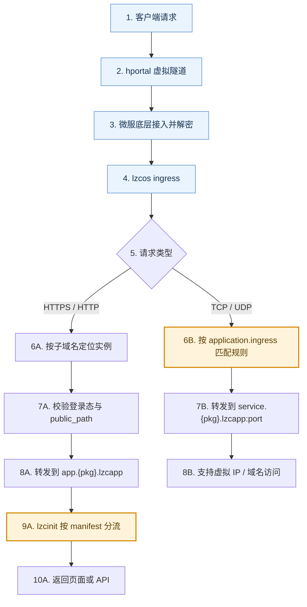

# LPK 如何工作：精简机制与最小规范 {#lpk-how-it-works}

## 为什么需要 LPK {#why-lpk}

先看传统 Docker/Compose 交付链路：

1. Docker Compose 已经解决了“多容器怎么一起跑”的一部分问题，明显优于手写零散命令。
2. 但在最终交付阶段，IT 维护职责仍常常落到用户侧：用户仍要处理环境变量、升级回滚、数据目录、日志排障等运维细节。
3. 这会导致角色重叠：本该由开发/平台承担的 IT 维护工作，被转移给了最终用户。
4. 对普通用户来说，这类操作通常繁琐且高风险；当技术能力或安全意识不足时，问题会进一步放大。

在懒猫微服里，LPK 进一步把这条链路做完整，重点是把 IT 维护职责前移到“开发者 + 平台机制”侧：

1. 开发者把应用身份、版本、入口路由、安全暴露边界、部署形态、数据目录语义等运行规则一起封装进 LPK。
2. 微服平台负责标准化安装、启动、运行与隔离机制，减少“每次部署都重新手工决策”的不确定性。
3. 用户拿到的是可复制的一键部署载体，重点是“使用应用”，而不是承担 IT 维护角色。

## 目标 {#goal}

完成本篇后，你可以明确区分并验证这 5 件事：

1. LPK 本质是一个打包文件（`tar` 或 `zip`）；你可以改后缀并直接查看内部内容。
2. `lzc-build.yml` 只在构建阶段生效；生成 LPK 后进入安装/运行流程时，系统不再读取你本地的构建配置文件。
3. 不依赖 `lzc-cli`，你同样可以按 LPK 规范手工产出一个可安装包。
4. Docker Compose 解决了部分编排问题，但 LPK 在微服场景下进一步解决了交付与 IT 维护职责下沉的问题。
5. 理解应用在微服中的两条流量路径：默认 HTTPS/HTTP 路径与 TCP/UDP 4 层转发路径。技术上它对应运行中的 lzcapp。

## 前置条件 {#prerequisites}

1. 你已完成 [有后端时如何通过 HTTP 路由对接](./http-route-backend.md)。
2. 你已经至少执行过一次 `lzc-cli project deploy`。

## 应用流量总路线图（技术上对应 lzcapp） {#lzcapp-traffic-map}



图例：

1. 蓝色节点（`1~4`）：微服平台通用安全防护机制，与具体应用无关。
2. 橙色节点（`6B`、`9A`）：应用开发者主要需要关注的位置，技术上对应 `application.ingress` 和 `manifest.yml`。

### 代码里对应的关键动作（精简版） {#code-level-mapping}

1. ingress 先按 `Host` 提取子域名，再找对应应用实例（支持多实例映射）。
2. HTTPS/HTTP 路径会做登录态检查；未登录且不在 `public_path` 的请求会被重定向到登录页。
3. 通过检查后，请求会转发到目标应用；应用内的 `lzcinit` 再按 `manifest.yml` 的 `routes/upstreams` 做最终分流。
4. TCP/UDP 路径使用 `application.ingress` 规则做 4 层匹配与转发，不做域名和 HTTP 语义解析。
5. 配置了 4 层入口时，系统会为该应用分配并维护独立虚拟 IP 映射规则；域名访问本质上是把域名解析到该虚拟 IP。

重要区别：

1. 两条路径在到达 ingress 之前完全一致。
2. HTTPS/HTTP 路径会做“实例定位 + 访问控制 + manifest 路由分流”。
3. TCP/UDP 路径只做 4 层转发，不解析 HTTP 语义。

延伸阅读：

1. [TCP/UDP 4层转发](../advanced-l4forward.md)

## 1. 开发与发布流程（按场景） {#dev-and-release-flow}

### 场景 A：日常开发（开发者自己反复验证） {#scenario-a-daily-development}

目标是“改完马上部署到目标微服验证”，推荐使用 `project deploy`：

```bash
lzc-cli project deploy
lzc-cli project info
```

默认约定：

1. 项目根目录默认会有 `lzc-manifest.yml`、`package.yml`、`lzc-build.yml`。
2. 如果存在 `lzc-build.dev.yml`，`project deploy`、`project info`、`project exec` 等 `project` 命令默认都会在开发态使用它。
3. 每个 `project` 命令都会打印 `Build config` 这一行。
4. `package.yml` 用来维护静态包元数据，不再建议把这些字段写回应用运行说明文件（manifest）顶层。
5. 如果要显式操作发布配置，请加上 `--release`。
6. `lzc-build.dev.yml` 只建议写开发态差异，例如 `pkg_id_suffix: dev`。

### 场景 B：CI 发布（产出可分发包） {#scenario-b-ci-release}

目标是“只产出发布物，不直接安装到某台微服”，推荐使用 `project release`：

```bash
lzc-cli project release -o release.lpk
lzc-cli lpk info release.lpk
```

说明：

1. `project release` 默认使用 `lzc-build.yml`。
2. 正式发布包应以 `lzc-build.yml` 作为权威配置。

### LPK 分发与离线安装 {#lpk-distribution}

`release.lpk` 可以有两种常见使用方式：

1. 通过应用商店分发。
2. 通过任意方式分享给朋友（聊天工具、文件传输等），对方把 `.lpk` 放到懒猫网盘后可直接点击安装。

## 2. LPK 本质是可打开的归档文件 {#lpk-as-archive}

先生成一个包：

```bash
lzc-cli project release -o release.lpk
lzc-cli lpk info release.lpk
```

你通常会看到这几类内容：

1. `manifest.yml`：应用运行说明文件。
2. `content.tar` 或 `content.tar.gz`：应用静态内容。
3. `images/`：可选，内嵌镜像 OCI layout。
4. `images.lock`：可选，记录镜像层来自 `embed` 或 `upstream`。

说明：

1. 如果你想直接打开 `.lpk` 查看内部文件，可用任意归档工具。
2. 重要提示：归档工具通常不会直接识别 `.lpk` 后缀，先复制一份并改成 `.tar` 或 `.zip` 后缀（以后者输出的 `format` 为准）再打开。

## 3. 构建配置文件只属于构建阶段 {#build-yml-build-stage-only}

构建配置文件的职责是告诉构建器“怎么产包”，例如：

1. 执行哪个 `buildscript`。
2. 从哪个 `contentdir` 收集内容。
3. 如何构建 `images`（embed image）。
4. 是否通过 `pkg_id_suffix` 产出独立的 dev 包名。

安装/运行流程读取的是 LPK 内部的产物（`manifest.yml`、`content.tar`、`images.lock` 等），不是你工作目录里的构建配置文件。

可以这样理解：

1. `lzc-build.yml` 像“默认构建配方”。
2. `lzc-build.dev.yml` 像“开发态覆盖层”。
3. `.lpk` 像“配方执行后的成品”。
4. 成品进入安装/运行流程后，不会回看本地构建配置文件本身。

一个典型例子：

```yml
# lzc-build.dev.yml
pkg_id_suffix: dev
```

它的作用只是让开发态部署产出独立 package id，例如：

1. dev 部署：`org.example.todo.dev`
2. release 发布：`org.example.todo`

这两个包名不同，因此开发态部署不会覆盖正式发布版本。

## 4. 不通过 `lzc-cli` 也能生成 LPK {#build-lpk-without-cli}

`lzc-cli` 是推荐工具，但 LPK 格式本身是开放可描述的。只要你按规范组织文件，就可以手工打包。

下面是一个最小示例（`tar` 形态）：

```bash
mkdir -p manual-lpk/web

cat > manual-lpk/package.yml <<'YAML'
package: org.example.hello.manual
version: 0.0.1
name: hello-manual
YAML

cat > manual-lpk/manifest.yml <<'YAML'
application:
  subdomain: hello-manual
  routes:
    - /=file:///lzcapp/pkg/content/web
YAML

cat > manual-lpk/web/index.html <<'HTML'
<html><body><h1>Hello Manual LPK</h1></body></html>
HTML

tar -C manual-lpk -cf manual-lpk/content.tar web
tar -C manual-lpk -cf hello-manual.lpk manifest.yml package.yml content.tar
```

这个包已经是合法 LPK 结构。  
结论是：`lzc-cli` 解决的是“工程化效率”，不是“格式唯一入口”。

安装这个手工打出的 LPK：

```bash
lzc-cli lpk install hello-manual.lpk
```

## 5. 出问题时优先看哪里 {#where-to-check-first}

1. 构建失败：先看构建配置文件与构建日志。
2. 安装成功但打不开：先看 `lzc-manifest.yml` 的 `application.routes`，也就是“请求该转到哪里”的规则。
3. 版本未更新：看 `lzc-cli project info` 的 `Current version deployed`。
4. 服务报错：看 `lzc-cli project log -f`。

## 验证 {#verification}

执行以下命令并检查输出：

```bash
lzc-cli project release -o release.lpk
lzc-cli lpk info release.lpk
lzc-cli project info
```

你应能回答这 4 个问题：

1. 当前这个 `release.lpk` 是 `tar` 还是 `zip`，并且可通过归档工具直接查看内部文件。
2. 为什么说构建配置文件属于构建阶段文件，而不是安装/运行阶段输入。
3. 如果不用 `lzc-cli`，你最少需要准备哪些文件来组织一个合法 LPK。
4. 为什么说 LPK 在微服场景里，把原本落在用户侧的 IT 维护职责前移到了开发者与平台机制。

## 常见错误与排查 {#troubleshooting}

### 1. `Build config file not found` {#error-build-config-not-found}

处理：确认你在项目根目录，并检查 `lzc-build.yml` 或 `lzc-build.dev.yml` 是否存在；命令输出里的 `Build config` 可帮助你确认当前实际命中的文件。

### 2. 修改了 `manifest` 但行为没变 {#error-manifest-changed-no-effect}

处理：重新执行 `project deploy`，不要只执行 `project info`。

### 3. `embed:<alias>` 报别名不存在 {#error-embed-alias-not-found}

处理：检查 `lzc-build.yml.images` 里是否定义了同名 alias。

### 4. 归档工具无法直接打开 `release.lpk` {#error-cannot-open-lpk-directly}

处理：

1. 先执行 `lzc-cli lpk info release.lpk`，确认 `format` 是 `tar` 还是 `zip`。
2. 复制一份并改成对应后缀后再打开（例如 `release.tar` 或 `release.zip`）。

## 下一步 {#next}

继续阅读：[高级实战：内嵌镜像与上游定制](./advanced-vnc-embed-image.md)

延伸阅读：

1. [lzc-build.yml 规范](../spec/build.md)
2. [lzc-manifest.yml 规范](../spec/manifest.md)
3. [lpk format 规范](../spec/lpk-format.md)
