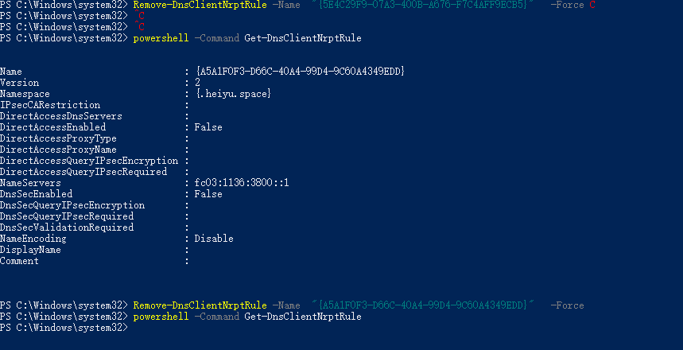

<!--
 * @Author: Bin
 * @Date: 2024-11-05
 * @FilePath: /lzc-developer-doc/docs/lzc-cli-wsl.md
-->
# 如何在 Windows WSL 中使用 lzc-cli

1. 关闭 windows 中的懒猫微服客户端

2. 在 WSL 中安装懒猫微服 linux 客户端 (我这里以 Ubuntu 为例)

```
sudo apt install zenity zstd
sudo apt install libnss3-dev libgdk-pixbuf2.0-dev libgtk-3-dev libxss-dev

/bin/bash -c "$(curl -fsSL https://dl.lazycat.cloud/client/desktop/linux-install)"
```

3. 启动懒猫微服客户端

```
~/.local/share/lzc-client-desktop/lzc-client-desktop
```

4. 输入设备名和密码登录懒猫微服设备

5. 安装 nodejs (我这里使用 nvm 安装) 以及 lzc-cli

```
curl -o- https://raw.githubusercontent.com/nvm-sh/nvm/v0.40.1/install.sh | bash

echo 'export NVM_DIR="$([ -z "${XDG_CONFIG_HOME-}" ] && printf %s "${HOME}/.nvm" || printf %s "${XDG_CONFIG_HOME}/nvm")"' >> ~/.bashrc
echo '[ -s "$NVM_DIR/nvm.sh" ] && \. "$NVM_DIR/nvm.sh" # This loads nvm' >> ~/.bashrc

nvm install v20
nvm use v20
npm install -g lzc-cli
```

6. 使用 lzc-cli 构建 lpk 应用以及安装 lpk
```
lzc-cli project build
lzc-cli app install cloud.lazycat.app.demo-v0.0.2.lpk
```

7. 尽情玩耍吧，上架 lpk 应用可以查看 [发布自己的第一个应用](./publish-app.md)


::: tip DNS解析问题 {#wsl_dns}

windows原生客户端在启动时，会使用`powershell AddDnsClientNrptRule`命令将`heiyu.space`相关域名都转发到
客户端的内部IP中。早期版本客户端并没有做清理工作，因此关闭windows客户端后再启动WSL客户端，并且WSL内使用的是默认
dns服务，会无法正常解析`heiyu.space`相关域名。

需要手动进行下清理(较新版本的windows客户端会在关闭时进行自动清理操作)

1. 查看相关规则`powershell -Command Get-DnsClientNrptRule`
2. 删除相关规则`Remove-DnsClientNrptRule -Name  "这里填写的是heiyu.space相关的Name UUID" -Force`



:::
